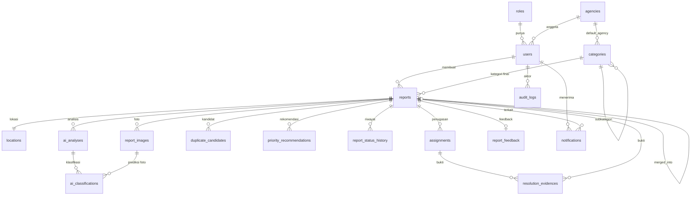

# TobaCare — ERD

```mermaid
erDiagram
  roles ||--o{ users : "punya"
  agencies ||--o{ users : "anggota"
  agencies ||--o{ categories : "default_agency"
  users ||--o{ reports : "membuat"
  categories ||--o{ categories : "subkategori"
  categories ||--o{ reports : "kategori final"
  reports ||--|| locations : "lokasi"
  reports ||--o{ report_images : "foto"
  reports ||--o{ ai_analyses : "analisis"
  ai_analyses ||--o{ ai_classifications : "klasifikasi"
  report_images ||--o{ ai_classifications : "prediksi foto"
  reports ||--o{ duplicate_candidates : "kandidat"
  reports ||--o{ priority_recommendations : "rekomendasi"
  reports ||--o{ report_status_history : "riwayat"
  reports ||--o{ assignments : "penugasan"
  assignments ||--o{ resolution_evidences : "bukti"
  reports ||--o{ resolution_evidences : "bukti"
  reports ||--o| report_feedback : "feedback"
  users ||--o{ notifications : "menerima"
  reports ||--o{ notifications : "terkait"
  users ||--o{ audit_logs : "aktor"
  reports ||--o| reports : "merged_into"
```
